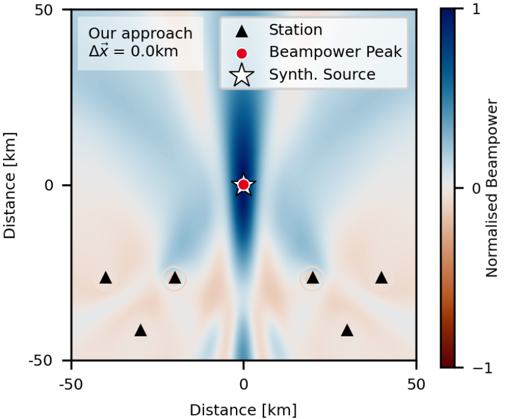

# Matched Field Processsing for complex Earth structure

Repository to accompany the paper entitled "Matched Field Processsing for complex Earth structure" by Schippkus & Hadziioannou, published as pre-print on EarthArXiv (---) and submitted to --- for peer review.

Here, we provide all scripts and data necessary to reproduce all of our results.

`/tutorial_notebook` contains a Python Jupyter notebook that introduces standard Matched Field Processing in a few easy steps.

`/settings_files` contains yaml settings files used in the Matched Field Processing code developed for this paper (see [seismology-hamburg/matched_field_processing](https://github.com/seismology-hamburg/matched_field_processing)). These are the input files used to generate the synthetic tests and real-data results in the manuscript. Note that for all figures, multiple `.yml` files are provided. These correspond either directly to each subplots or the type of GF used.

`/data_info` contains information on which stations and data exactly were used for the two real data examples in Figures 5 & 6 of our manuscript. For the Chino Hills earthquake, this includes data from 54 seismic stations of the CI network (estimated file size 40 MB). For the continous seismic data in February 2019, this includes data from 342 of the BE, BW, CH, CZ, DK, EI, FR, G, GB, GE, GR, GU, II, IM, IU, IV, LX, MN, NL, NO, OE, OX, PL, PM, RD, SX, TH, and WM networks (estimated file size 2.0 GB). For citations of these networks refer to our paper or [fdsn.org/networks](https://fdsn.org/networks).

`/figure_scripts` contains Python scripts used to produce the figures in our manuscript from the output files of [seismology-hamburg/matched_field_processing](https://github.com/seismology-hamburg/matched_field_processing) using the settings files in `/settings_files`. Note that these scripts will require adapation to your file structure. They are provided as-is and are not well-documented.
